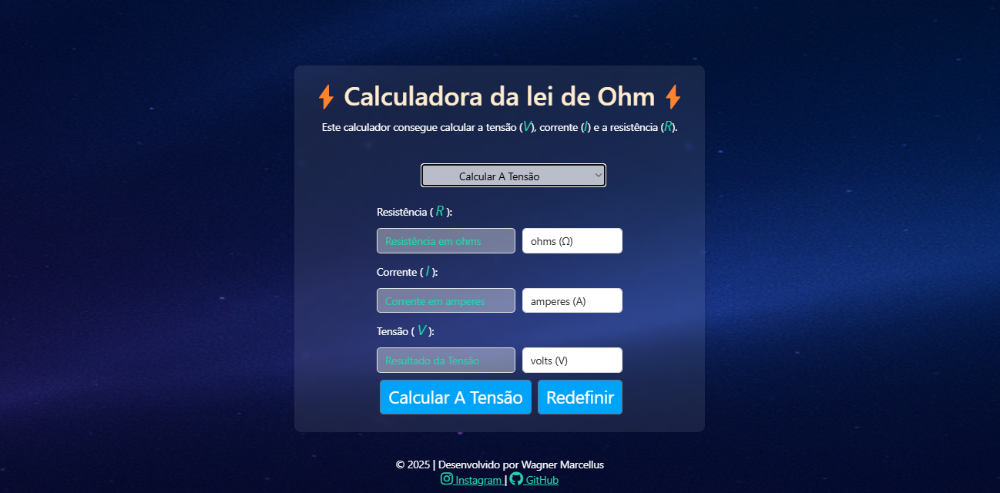

# ⚡ Calculadora da Lei de Ohm - SENAI DS 💡📐

Este é um projeto desenvolvido durante o curso de **Desenvolvimento de Sistemas (DS)** no **SENAI** 🏫.  
Seu objetivo é aplicar os conceitos de **HTML, CSS e JavaScript** para criar uma calculadora interativa da **Lei de Ohm**.

---

## 🧠 O que é a Lei de Ohm?

A Lei de Ohm estabelece a relação entre **tensão (V)**, **corrente (I)** e **resistência (R)**:

> **V = I × R**

Com essa fórmula, é possível calcular qualquer um dos três valores conhecendo os outros dois.  
🔌 Essa lei é fundamental na área de eletrônica e eletricidade!

---

## 🛠️ Tecnologias Utilizadas

- 🌐 **HTML**
- 🎨 **CSS**
- ⚙️ **JavaScript (puro)**

---

## 🧰 Funcionalidades

- ✅ Calcular Tensão (V)
- ✅ Calcular Corrente (I)
- ✅ Calcular Resistência (R)
- 📱 Totalmente Responsivo
- 🎛️ Interface simples e intuitiva

---

## ✨ Como Usar

1. Escolha no **menu suspenso (select)** qual grandeza você deseja calcular:
   - ⚡ Tensão (V)
   - 🔥 Corrente (I)
   - 🌀 Resistência (R)

2. Após selecionar, o formulário mostrará os campos necessários para o cálculo.

3. Preencha os dois valores pedidos e clique no botão **"Calcular"**.

4. O resultado da grandeza escolhida será exibido automaticamente na tela. 🎉

---

## 📸 Captura de Tela

---

## 🔗 Acesse o Projeto Online

Você pode visualizar e usar a calculadora diretamente pelo navegador:  
👉 [**Abrir Calculadora da Lei de Ohm**](https://wagnermarcellus.github.io/eletro-calculator/)

---

## 👨‍💻 Sobre o Projeto

Este projeto foi feito com muito aprendizado e dedicação.  
O foco é reforçar conceitos de **JavaScript**, **eventos**, **DOM** e **interatividade** com o usuário.

---

## 📲📸 Me encontre no Instagram!

Quer acompanhar mais projetos? Me segue lá:  
[@wagnermarcellus](https://instagram.com/wagnermarcellus) ✌️📱

---

🛠️ Feito com 💙 no SENAI - Desenvolvimento de Sistemas
